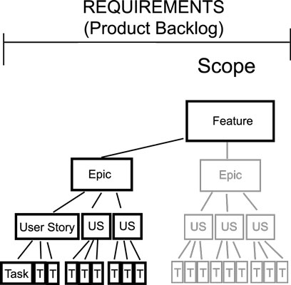
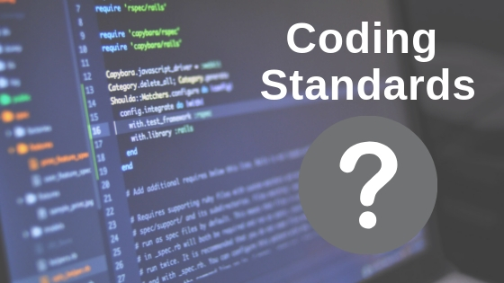
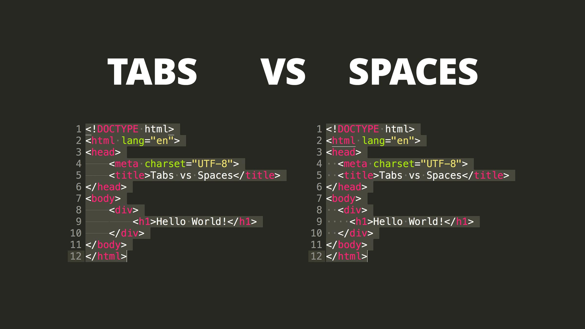

# Task Estimation In Scrum
 
 
Task estimation is an essential part of any scrum process. Team members must estimate
the duration and effort of each user story in the sprint backlog using a shared task list. Denise Canty 
outlines the benefit of task estimation on her [blog](https://www.projectmanagement.com/blog-post/46054/Task-Estimation-with-Scrum#:~:text=The%20most%20commonly%20used%20Scrum,backlog%20item%20to%20similar%20items.&text=Story%20points%20do%20not%20measure,a%20user%20story%20or%20task.):
>This practice results in a shared team perspective, resulting in a task estimation process that
is consistent and reliable throughout all Sprints.

## Best Practices

- **Decide the value of a story point and stick to it.**
 
  Story points do not have a set value, so it's up to the scrum team to decide on that value and 
  be consistent throughout the project. For example, if the value of a story point has been assigned 1 day,
  then a task which is assigned 3 story points would amount to 3 days of work. This allows for a clear
  understanding of relative levels of effort for a task compared to other tasks.  
  
  

- **Decompose Tasks**
  
   
  
  The task list contains all task that need to be completed in order to complete the user stories. Larger, high level tasks should be broken down 
  into smaller tasks with improved detail, which will allow the team to create product deliverables from the task list items. However, ensure that 
  you are prioritising the most important items to decompose. 
  As Mark Layton says in his [article on scrum decompisition](https://www.dummies.com/careers/project-management/scrum-decomposition-definitions/):
  > A requirement must earn the right of your investment. Only the highest priority items deserve your time in breaking them down into digestible requirements. Everything else can wait. This way, you are always only working on the most important things.
  

-  **Outline Task Dependencies**
  Once user stories are chosen, staff and technical dependencies should then be considered. By properly documenting
  these dependencies, the scrum team can determine the order in which to execute tasks. There are several types of dependencies, 
  including mandatory and discretionary, internal and external, or a combination of these. SCRUMstudy provide some good examples 
  in their [scrum dependency blog](http://blog.scrumstudy.com/dependency-determination-in-scrum-project/) to help understand 
  these dependencies, which will be shown below.

  **Mandatory**: This dependency can be a result of physical limitations, also known as "hard logic", or perhaps contractual 
  obligations and legal requirements that must be met. 
  >For example, work on the first floor cannot begin until the foundation of the building is complete.

  **Discretionary**: Discretionary dependencies are ones which are put in place by the scrum team by choice. They are usually 
  implemented due to prior experiences or accepted best practices, but are not necessarily required. 
  >For example, the team may choose to build the door and window frames before the full structure of the wall is in place.
  
  **External**: External dependencies are outside the scope of the scrum team, yet are necessary for the completion of the 
  project task. This could be certain tasks, activities or products that are outside of the team's control. 
  >For example, if the Scrum Team is not responsible for procuring the materials required for building the walls, then 
those materials and tasks related to their procurement are considered external dependencies.
  
  **Internal**: Finally, internal dependencies are task, activities or products that are within the scope and control of the 
  scrum team. They are basically part of the project work that must be completed. 
  >For example, installing drywall must be completed before painting the wall can begin.

***
***

#### Estimation Techniques 
Using story points as measures relative to effort levels allows teams to estimate work they must complete simultaneously.
Scrum being part of agile, uses a top down process and normally pushes teams to propose an estimate of long and how much effort is required for a task to be complete. There are a number of ways in which teams estimate the time and effort required 5 of which are the following: 

- **Planning Poker**
 
	- Using story points to estimate a tasks difficulty based on the fibonacci sequence ( 0,1,2,3,5,8,13,20,40 and 100) with each number representing a different level of complexity. 
 	Team members should use numbered cards to vote for an estimate of a task. Voting continues until all are agreed upon and unanimous after discussion. It is open to interpretation among teams so  many minor variations of the procedures are conducted depending on your teams understadning. 

	* Pros 
	Good Technique to use when your team numbers are small and where there are 10 or less items to vote on
	Considered to be popular in the industry
	
	* Cons
	Not good for use with large teams and where the number of tasks to be estimated are high in numbers
 	

- **Sizing (T - shirt)**
 
	- Using sizes as story points for the size estimates of tasks. Gives a quick and rough estimate for how much work is expected and the sizes can be converted into numerical values at later stages. Decisions should be made through discussion amongst the team. 
	
	* Pros 
	Good for larger number of tasks
	
	* Cons 
	Open to interpretation of individuals, some tasks may seem greater for others and can lead to confusion and in worst cases conflict. 

- **Dot Voting**
 
	- Each team member gets a small number of "dots"  and uses them to estimate the size of a task, more dots means more time and effort.
	
	* Pros 
	Very efficient for small teams
	Very good visualisation tool 
	
	*Cons 
	Not necessarily an estimation technique, regarded more so as a decision making tool. 

- **Bucket System**
 
	- Uses the same structure of planning poker, your group or team place tasks in "buckets" that have a difficulty or another measurement attached to them, after confirming with others. A divide and conquer phase is present after assigning tasks to buckets. Buckets can be changed and rearranged if necessary. 
	
	* Pros
	Faster than Planning Poker due to the divide and conquer phase 
	Can be used with larger groups and with larger numbers of tasks
	
	* Cons 
	Not useful for small teams 
	Open to interpretation by individuals 
	

- **Affinity Mapping**
 
	-  Tasks are grouped by effort similarity, this can be easy, medium, hard etc. Team members place to their tasks with their perceived relative effort level or size. These can be changed as the process continues and discussed as they go. Once your team are finished editing they can finalize the product backlog items in their positions. 
	
	* Pros
	Good for smaller teams 
	
	*Cons 
	Bad choice if you have a large number of backlog items

 

##### Pros and Cons of Estimating techniques 

Story points are abstract estimates open to interpretation, usually inaccurate and not precise allowing a greater level of flexibility. As opposed to directly placing a specified value of time on a task where one team or individual can be held to a time frame whether its an estimate or not. 
Estimating addresses external communication problems and management outside the team of expectations placed on them. 
Estimating increases the likelihood of a project finishing at a time they say they will allowing for a large range of uncertainty in the process which will be driven out early on in the schedule. 

However story points can lead to much confusion. Not every understands their value or what they may be interpreted as or how to use them properly. Lack of understanding and training is often the cause. Teams can often take a longer time to work out estimates as team members may be on different skill levels or understandings of certain tasks or effort levels required. Can be highly methodical, time consuming if not done efficiently and disgruntled team members if misunderstandings or disputes occur over estimations. 

##### How estimates can go wrong
 

Poor estimation and judgement is the main cause of project failure however there are many reasons for this. Some of which that can attribute are the following
 

1. **False analogies** : Estimates based off past experiences and past project data is considered to be more reliable than using modern techniques of judgement. This works for projects with identical traits and features. The problem occurs when one does not know what is relevant and what is not, it's easy to base estimates off a previous project which is similar in stature but differs in critical ways, leading to false judgement, over or underestimating and lost in time and possible increases in cost.  

2. **False precision** : Estimates often get quoted as single numbers rather than a range or ranges. These estimates are incorrect as they ignore that uncertainties should be calculated by ranges rather than a set value. Single number estimates are almost certain to be incorrect 

3. **Estimation by decree** : The estimation should be done judged by those who will be doing the work, often this principle is sacrificed for pre-determined time lines with the estimates drawn up by project leaders or members who have little involvement in the work. 

4. **Subjectivity** : Where estimates are guessed off individuals own perceptions and not previous experience of facts. Usually a form of cognitive bias and justified by the individual(s)

5. **Coordination neglect** : Generally an issue encountered by larger teams but occurs as projects consist of diverse tasks requiring careful integration. This often overlooked by project decision makers, this problem occurs in projects off all sizes but becomes significant in projects consisting of large numbers of dependent tasks and external dependencies. 

6. **Too course grained** : Tasks that are large are usually made up of smaller tasks to be completed and merged in specific ways. As a result estimates should be based on the smaller taks at hand instead teams tend to often attempt to estimate the larger task as a whole directly. These estimates can often turn out to be incorrect as the smaller sub tasks get overlooked and coordination neglect can often occur as discussed in the previous point. 
 

# Code Standards 

By definition coding standards are a set of practices and guidelines that determine the style 
and procedure of a specific programming language or project. These standards offer a uniformity and 
structure to massive code bases which have many developers collaborating on them with various different 
styles and habit's. 

***Why should you use code standards?*** 
 

Code standards offer many benefits to a team such as 

1. Improves readability while also reducing complexity  
		- Methods can be unreadable and become difficult to maintain if a uniformity of style is not enforced.
2. Prevents the unnecessary reusing of code as well as highlights errors  
		- Reduces redundancy and simplifies error catching as the code is easier to understand.
3. Encourages positive integration of teams  
		- Allows team members to follow and collaborate on one anothers work.
4. Reduce the overall cost of development  
		- Coding standards lead to less major errors and setbacks within a project.
5. Offers accountability of work and ensure correctness of code  
		- Without coding standards in a team, each member of the team would have their own unique approach and style of writing code.

 
coding standards offer tried and testing benefits to organisations 
and team's who utilise them, but the efficacy of these practices relies 
heavily on how the standards are embedded and what aspects of the 
project are considered important enough to follow procedure.

### Implementation

How standards should be enforced is an important decision, things as 
major as class names and project structure as well as comment style all
have potential to be standardized. An example of some common practices are:

* Naming conventions ensure that classes, functions and variables names are consistent across the project. Names should be useful, prounceable and not misleading so any person looking at your code is able to easily understand.
* Ensuring functions do not exceed a certain size. Long functions can be difficult to easily understand and make the code appear more complex than it may be. Following the "Rule of 30", methods should not contain more than 30 lines of code (on average).
* Documentation. Comments within the code allow future readers to grasp the code much more thoroughly and in less time.
* Indentation. When we consider the above image of "Tabs vs spaces", we can see that a tab can be a number of columns, however a space is always just one column. You should use white space within your code to improve readability. Some useful rules to remember are that all braces should start on a new line, and after a brace is closed there should be no further code on that given line.
* Control the access and scope of certain variables. Variables should only be visible to classes and objects that need to see them. Avoid declaring global variables where possible.
* Efficiency versus Complexity. Big O notation can give us an understanding of the amount of time required by an algorithm.
* Error handling procedures. All functions in your code that return an error, should return either the value 0 or 1. This greatly helps in making the debugging process easier.  
develop

These standards not only allow individuals to work more efficiently in a
group setting, but it also encourages an environment of excellence to which
people shrive to achieve. Code standards improve the performance of the developers 
within team as well as increasing development time, minimizing and highlighting bugs 
as well as reducing the overall cost of the project

***Negatives of not utilising code standards*** 
 

A coding standard  makes sure developers are following guidelines on projects. 
Without the implementation of standards the project can be considered to be missing the essential attributes necessary in software development. Without standards the particular work in progress can lack style, structure and have a mixture of procedures involved that will affect the consistency and have an overall negative impact on the quality of a program.
For most organisations, smooth functioning programs are vital for growth. Coding standards are needed for development success. 
 

Without standards projects may encounter some of the following **problems** 
 
    * Developers can all have different styles and ways of doing things making team work more challenging and hard to follow
    * Can become hard to enforce as procedures must be created in order to follow standards if they are implemented at a later stage, meaning code refactoring of projects/programs and change in code creation. 
    * Certain standards may not be suitable for use on different languages, allowing programs to be written with incorrect syntax/semantics.
    * Enforcing standards may be difficult to enforce in large teams and can be very time consuming.
    * Less accountability for work in teams.
    * Security concerns can be raised if code is inconsistent, logically incorrect or contain bugs.
    * Can cause performance issues due to poor code quality with no standards to correct the issue.
    * Difficulty in reading code for anyone as naming conventions and indentation may not be adhered to.

 

**Summary - Pros and Cons of standards**

_Positives_
 

	* Code Quality
	* Efficiency
	* Accountability
	* Error handling 
	* Reduced Complexity 
	* Simplified Maintenance 
	* Cost Efficiency 
	
_Negatives_
  

	* Security
	* Inconsistency 
	* Can become costly 
	* Risk in performance 
	* Legibility
	* Difficulty in error handling and complexity 
	

# Code Reviews

Coding Standards can be a daunting experience for some, but it should not be, 
a code review offers a developer an opportunity to reflect on their contribution 
to a project in a way that encourages them to improve and to identify their weaknesses
in effort to support them and help them improve the way they code. At its worse , a code 
review can embarrass and intimidate developers and cause more harm than good. It is very 
important that code reviews are conducted effectively so that everyone involved should 
feel a sense of achievement from the process.

### Why should your team use code reviewing?

There are a number of benefits that can be gained from using code reviews inside your software development project.

* **Ensuring code quality** - Examining the code and making sure that there are no unfulfilled or poorly working features.
* **Improve code performance** - A piece of code may be working as intended, however can also compromise performance and cause occasional runtime errors. Code reviewing can resolve these issues.
* **Maintaining consistent design** - Several developers may contribute to the same section. The review process helps to identify any possible differences and keep the project cohesive and easily understandable.
* **Learning potential** Throughout the code review, knowledge may be shared on best practices and how aspects can be improved. New developers can gain valuable knowledge that aids them going forward to future projects.

### Conducting a code review 

There are various steps that can be taken to ensure an open-minded and 
meaningful process.

* **Create a Collaborative environment** - Drive home the point that the process is for the 
purpose of knowledge and sharing 
* **Breakdown Reviews** - frequent code reviews with smaller increments of progress are much 
easier to assess and improve further reviews
* **Initiate Reviews** - Making developers ask for a review can make them feel like a nuisance 
and asking other developers to review can put them under pressure, add structure to your code 
reviews 
* **Keep an open mind** - Criticism does not have to be insulting or discouraging, it is 
important to empathise with the person you are reviewing, remember that the aim of this process
is to help others improve and to share knowledge.

## Deliverables 

Reviews are not just to foster developer improvement and growth, code reviews are also
a method of examining the progress of the product's development. Managers can identify 
the whether certain features are falling behind schedule or making excellent progress, it can 
tell the team whether they need to realign their focus or there are issues which need to be 
dealt with immediately. 

 

Example of metrics that can be used in review's to assess progress

 

* Error's, bugs, flawed logic and code which could potentially fail 
* The codebase compared to the requirements set out by the owner 
* Whether the code aligns with the standards set by the team
* Have dependencies become more complex or demanding? 
* Will more tests need to be written to account for the newest additions? 

The outcome of a review can dictate the direction the team will take going forward 
as well as influence the frequency and manner in which future reviews will be conducted.
   

**Sources**
 
* [Coding standards and guidelines](https://www.geeksforgeeks.org/coding-standards-and-guidelines/)
* [Code standards in soft dev](https://medium.com/@psengayire/the-importance-of-coding-standards-and-conventions-in-the-software-development-team-how-they-can-5d252556a05)
* [Code standards](https://medium.com/swlh/be-an-effective-and-efficient-programmer-aabde20c673e)
* [Rule of 30](https://www.linkedin.com/pulse/rule-30-when-your-method-class-packages-too-big-maaz-rehman/)
* [coursehero](https://www.coursehero.com/file/p15us6sn/Advantages-of-following-coding-standard-and-disadvantages-of-not-following-it/)
* [answers](https://www.answers.com/Q/What_are_the_advantage_and_disadvantage_of_coding_standards)
* [codingstandards](https://www.slideshare.net/ifourakash/coding-standards-and-best-practices-36493912)
* [multidots](https://www.multidots.com/importance-of-code-quality-and-coding-standard-in-software-development/)
* [mountaingoatsoftware](https://www.mountaingoatsoftware.com/blog/why-agile-teams-should-estimate-at-two-different-levels)
* [reqtest](https://reqtest.com/agile-blog/agile-estimation-techniques/)
* [berteig](https://berteig.com/how-to-apply-agile/9-agile-estimation-techniques/)
* [quora](https://www.quora.com/In-sprint-planning-what-are-the-pros-and-cons-of-using-story-points-hours-or-both-when-creating-estimates)
* [eight2late](https://eight2late.wordpress.com/2010/10/01/six-ways-in-which-project-estimates-go-wrong/)
* [Importance of Coding standards](https://medium.com/@psengayire/the-importance-of-coding-standards-and-conventions-in-the-software-development-team-how-they-can-5d252556a05#:~:text=Coding%20standards%20are%20collections%20of,methods%20for%20a%20programming%20language.&text=Without%20the%20coding%20conventions%2C%20every,code%20in%20the%20near%20future.)
* [How to enforce Coding Standards](https://www.perforce.com/blog/sca/how-enforce-coding-standards)
* [Why code reviews matter](https://www.atlassian.com/agile/software-development/code-reviews)
* [Healthy Code Review](https://www.smashingmagazine.com/2019/06/bringing-healthy-code-review-mindset/)
* [Examples of Code Reviews](https://andreigridnev.medium.com/examples-of-code-review-checklists-and-guides-2dfed082a86d)
* [Why code reviews are important](https://www.hexacta.com/5-whys-code-review-is-important-in-any-software-development/)
* [Code review importance](https://www.brightspot.com/products/developer-life-5-reasons-why-the-code-review-process-is-critical-for-developers)

