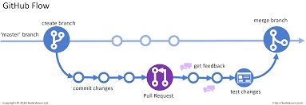

# Plan 

## Introduction
 
To begin our process we must evenly divide the workflow amongst ourselves, 
the three sections that make up the hand book will have two collaborators each, the 
assigned sections will distributed to the following members of the team.

 **Team Members**
- Jamie Power
- Vinay Kumar
- Yousef Indja
- Malachy Keaveny

## Breakdown

 

* Task Estimation in Scrum :  **Vinay and Yousef** 
 

* Coding Standards : **Yousef , Vinay and Jamie**
 

* Code Reviews : **Malachy , Yousef and Jamie**

 

Each task will have its own checkout branch which is where each task 
will be built and commits will be published. 

One each task is sequentially 
completed, the developers working on the task will conduct a pull request and 
the team will review. Once the team is satisfied with the standard of the 
submission we will merge the branch with the main and amend the changes 
to the final product.

 

## Review

 
When the tasks have been completed all members of the 
team will convene in order to assess the finished product, ensuring 
there are no spelling errors, duplicate entries, and that we are satisfied 
with the formatting of the document as well as appropriate citation and sourcing 
is included for the references used. 

 
 

Once everyone is satisfied with the product
all hotfixes and minor changes are merged with the main branch and the project 
is submitted. We will also conduct a reflection on the project and discuss
what the team would have done differently as well as any issues the team 
faced during the process.
 

### Group 9 Reflection 

Having completed this assignment there are a number of things we would have done differently. We feel that we would have benefited as a group from a better understanding of git and its commands before undertaking the assignment as we encountered a number or difficulties with merging branches and pull requests. 
 

Error handling was a problem for us and we would have liked to have more experience with merge conflicts and other issues encountered in branching. 
Division of workload became a problem as we ended up having 3 people on 1 topic at times which became challenging in terms of information availability and overlap of work. Better communication amongst members and collaboration working on the same topics would be beneficial for the next project. 
 

Through completing this project, all of us greatly improved our understanding of the git process. It is a truly impressive software which has accounted for so many different situations and problems that may arise during a software development project. Using the feature branches to work on each of the three content sections allowed us to see the work being done by each member at each stage of the project. Working through the merge conflicts as a team was challenging, however was a very beneficial process that will stand to us as developers.